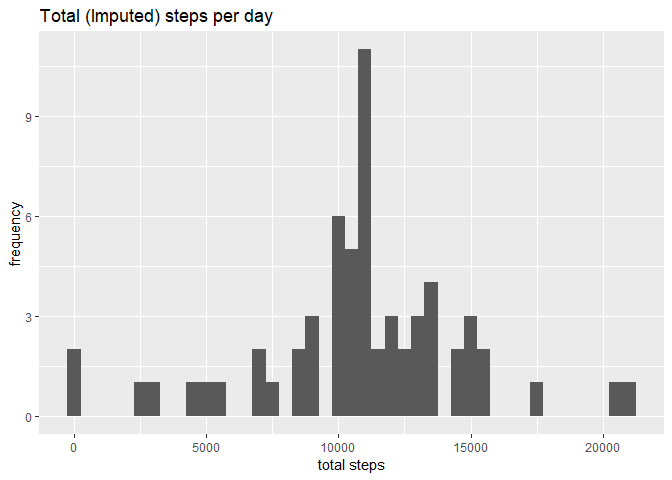

## Loading and preprocessing the data

```r
if(!file.exists("activity.csv")){
  unzip(zipfile = "activity.zip")
}
df <- read.csv("activity.csv")
```


## What is mean total number of steps taken per day?

#### 1. Calculate the total number of steps taken per day

```r
x1 <- tapply(df$steps, df$date, sum, na.rm = TRUE)
x1 <- x1[!is.na(x1)]
```

#### 2. Make a histogram of the total number of steps taken each day

```r
qplot(x1,main = "Total steps per day", binwidth=500,xlab="total steps",ylab="frequency")
```

<!-- -->

#### 3. Calculate and report the mean and median of the total number of steps taken per day 

```r
# the mean
mean_x1 <- mean(x1)
median_x1 <- median(x1)
```
Mean is: 9354.2295082 Steps

Median is: 10395 Steps

## What is the average daily activity pattern?
#### 1. Make a time series plot (i.e. type = "l") of the 5-minute interval (x-axis) and the average number of steps taken, averaged across all days (y-axis)

```r
x2 <- aggregate(df$steps,list(df$interval), mean, na.rm=TRUE)
colnames(x2) <- c("Interval","Steps")
ggplot(data = x2, aes(x = Interval, y = Steps))+geom_line()
```

<!-- -->

#### 2. Which 5-minute interval, on average across all the days in the dataset, contains the maximum number of steps?

```r
# finding out the maximum 
maximum_steps <- max(x2$Steps)
a <- x2$Interval[x2$Steps == maximum_steps]
```
The Interval no. 835 has the maximum number of steps 

## Imputing missing values
#### 1. Calculate and report the total number of missing values in the dataset 

```r
# no. of missing vals in a dataset
na_vals <- sum(is.na(df))
```
The total number of missing values : 2304

#### 2. Devise a strategy for filling in all of the missing values in the dataset. The strategy does not need to be sophisticated.
*We will impute the missing values with the mean of that day*

```r
dfImputed <- df
dfImputed$steps <- impute(x = dfImputed$steps, fun = mean) 
```

#### 3. Make a histogram of the total number of steps taken each day and Calculate and report the mean and median total number of steps taken per day. 

```r
x3 <- tapply(dfImputed$steps, dfImputed$date, sum)
qplot(x3,main = "Total (Imputed) steps per day", binwidth=500,xlab="total steps",ylab="frequency")
```

<!-- -->

```r
x3_mean <- mean(x3)
x3_median <- median(x3)
```

The mean is: 1.0766189\times 10^{4}

The median is: 1.0766189\times 10^{4}

## Are there differences in activity patterns between weekdays and weekends?
#### 1. Create a new factor variable in the dataset with two levels - "weekday" and "weekend" indicating whether a given date is a weekday or weekend day.

```r
dfImputed$dayType <-  ifelse(weekdays(as.Date(dfImputed$date), abbreviate = TRUE) %in% c("Sat","Sun"),'weekend','weekday')
```
#### 2. Make a panel plot containing a time series plot of the 5-minute interval (x-axis) and the average number of steps taken, averaged across all weekday days or weekend days (y-axis).

```r
x4 <- aggregate(data = dfImputed, steps ~ interval + dayType, mean)
ggplot(data = x4, aes(x = interval, y = steps))+geom_line()+facet_grid(dayType~.)
```

<!-- -->
